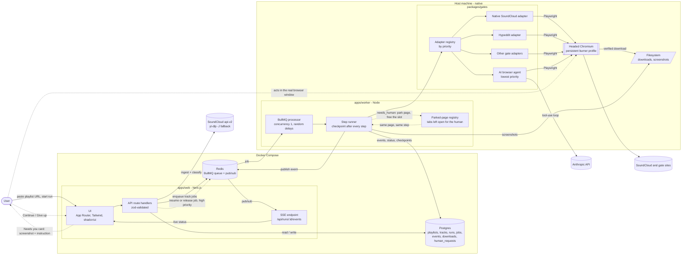
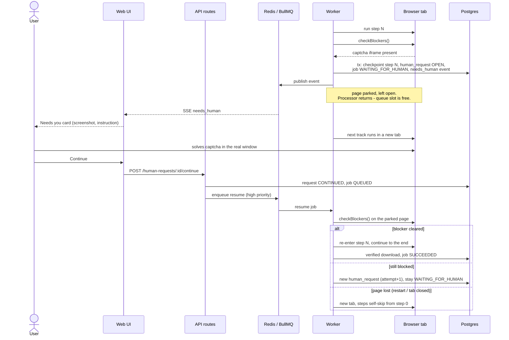
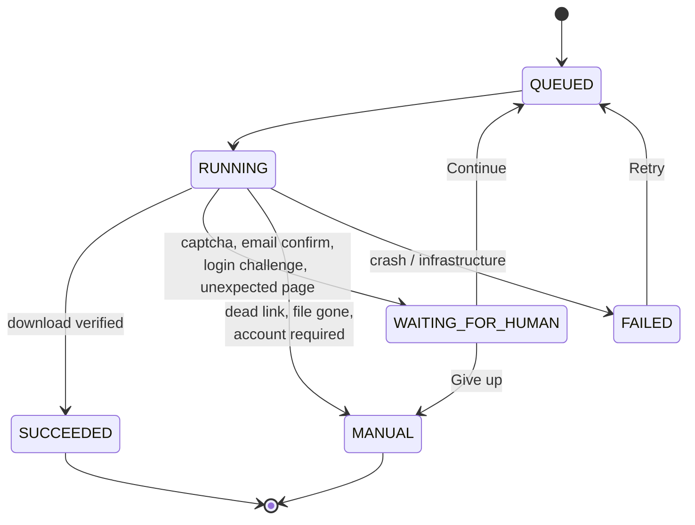

# Architecture

Gatecrusher is a pnpm + Turborepo monorepo. The web app and its API run in Docker alongside Postgres and Redis; the worker runs natively on the host so its headed browser window is visible to the user.

## System overview



## The needs_human loop



Details, timeouts and restart behaviour: `.claude/skills/human-in-the-loop/SKILL.md`.

## Packages and responsibilities

| Package | Owns | Must not |
| --- | --- | --- |
| `apps/web` | UI, API route handlers, SSE, CSV export, enqueueing | Drive a browser; contain gate logic |
| `apps/worker` | BullMQ processors, browser lifecycle, step runner wiring, parked pages, download storage, startup reconciliation | Serve HTTP to the UI |
| `packages/db` | Drizzle schema, migrations, repository functions | Contain business rules |
| `packages/core` | Types, zod schemas, classifier, `GateAdapter` interfaces, result types, job state machine | Import any other workspace package or do I/O |
| `packages/gates` | Adapters, blocker detection, step runner, AI agent | Import `db` or the queue — it reports via `GateContext` |

## Data model (outline)

- **playlists** — canonical SoundCloud URL (the re-ingest key), title, owner, ingest source (`api_v2` | `yt_dlp`), last ingested.
- **tracks** — SoundCloud id, title, artist, permalink, `purchase_url`, `purchase_title`, `downloadable`, classification (`native` | `gate` | `buy` | `none`), detected gate platform.
- **runs** — one execution of a playlist; aggregate counts and status.
- **jobs** — one per track per run: status, adapter id, `step_index`, adapter `state` (JSON), attempts, manual reason + link.
- **events** — append-only log per job: type, step, screenshot path, error, payload (JSON, zod-validated per type).
- **downloads** — file path, size, MIME, kind (`audio` | `archive`), checksum, verified-at; unique per track.
- **human_requests** — reason, description, screenshot, page URL, status, attempt, session-alive flag, resolution.

Postgres is the source of truth. Redis carries jobs and change notifications only; the UI can always rebuild its view from Postgres.

## Job lifecycle



`buy` and `none` tracks never get a browser job; they go straight to the buy list or are shown as having no download.

## Adapter selection

1. The classifier (pure, in `core`) labels the track from SoundCloud metadata.
2. `native` -> native SoundCloud adapter. `gate` -> the registry returns the highest-priority adapter whose `detect(url)` matches.
3. If no specific adapter matches, the AI browser agent (lowest priority, matches anything) takes it.
4. All adapters run through the same step runner, emit the same events, and pause/resume the same way.

## Filesystem layout (host, configurable via env)

```
data/
  browser-profile/              persistent Chromium profile (burner login) - never committed
  downloads/<playlist-slug>/<artist> - <title>.<ext>
  screenshots/<run-id>/<job-id>/<seq>-<label>.png
```

The web container mounts `data/screenshots` read-only to serve images to the UI through a route that only resolves paths recorded in the database.

A download is written under a temporary name (`.partial-<uuid>`) and only renamed into place once it has passed verification; a failed one is deleted. A second file wanting the same name becomes `<artist> - <title> (2).<ext>`.

## Deployment shape

- **Development:** `docker compose up` -> Postgres and Redis only. Web runs natively with `pnpm dev` (fast reload, direct access to `data/`).
- **Production:** `docker compose --profile web up` -> Postgres, Redis, and the built web image, with `data/screenshots` mounted read-only.
- `pnpm --filter @gatecrusher/worker start` on the host -> worker + visible browser, connecting to the Compose-published Postgres and Redis ports on localhost.
- Everything is expected to run on one machine the user controls. The web UI is intended for local/LAN use.
